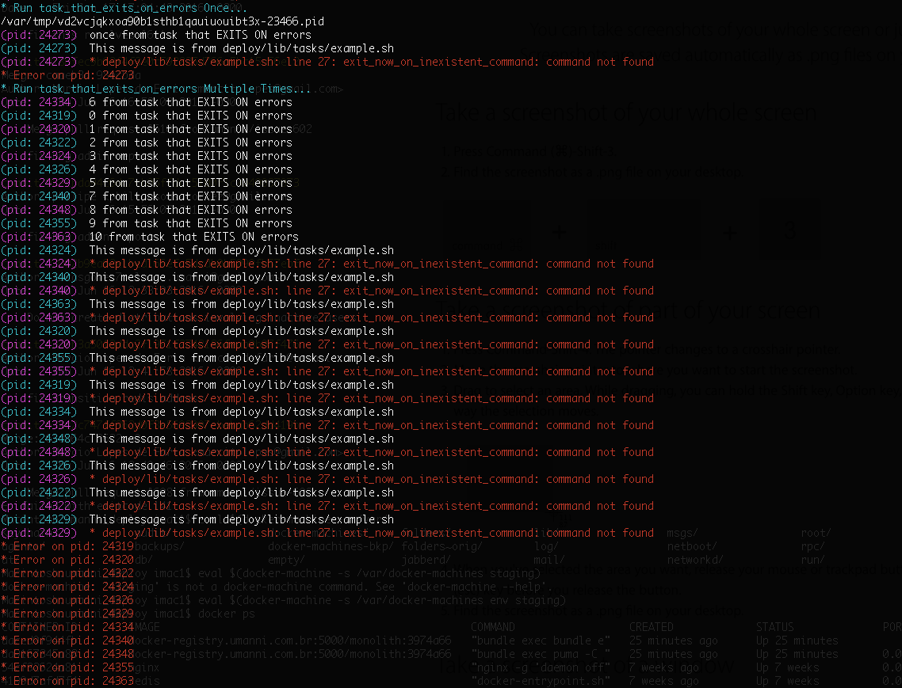

# bash_async_tasks

Small helper functions to run tasks async on Bash

This lib provides 3 primitives to help run functions on bash asynchronously:

`task_start` `task_run` `task_wait`

This is an example get from `tasks/example.sh`

```bash
__dir="$(cd "$(dirname "${BASH_SOURCE[0]}")" && pwd)"

regular_task() {
  echo "$@"
  sleep $(echo $RANDOM % 10 + 1 | bc)
  echo "This message is from ${0}"
}

run() {
  echo "${CYAN}* Run regular_task Multiple times...${NORMAL}"

  task_start

  for i in {0..10}; do
    cmd=(regular_task ${i} "from regular task")
    task_run cmd[@]
  done

  task_wait
}

run
```

The logged output is prefixed with the `pid` that is running the task.

This should produce an output as showed bellow:




